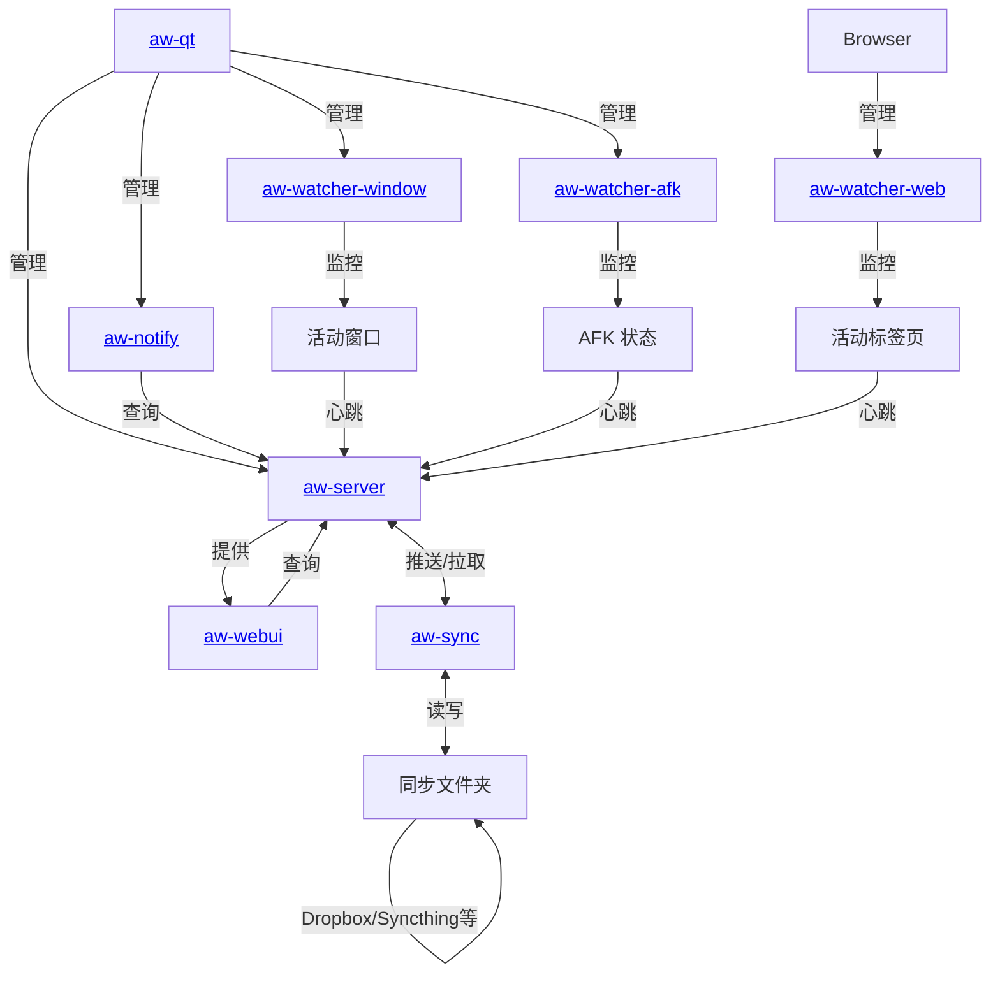

[ | ](README.zh.md)

  <b>Records what you do</b> so that you can <i>know how you've spent your time</i>.
   
  All in a secure way where <i>you control the data</i>.

  
  

   

  <b>
    <a href="https://activitywatch.net/">网站</a>
    — <a href="https://forum.activitywatch.net/">论坛</a>
    — <a href="https://docs.activitywatch.net">文档</a>
    — <a href="https://github.com/ActivityWatch/activitywatch/releases">发布</a>
  </b>

   

  <b>
    <a href="https://activitywatch.net/contributors/">贡献者统计</a>
    — <a href="https://activitywatch.net/ci/">CI 概览</a>
  </b>

  
  
  

   

  
  
  

   

  
  

*你想通过电子邮件接收重大公告吗？* 
***[订阅新闻通讯](http://eepurl.com/cTU6QX)！***

 
目录

 * [关于](#关于)
    * [截图](#截图)
    * [这是又一个时间追踪器吗？](#这是又一个时间追踪器吗)
       * [功能对比](#功能对比)
    * [安装与使用](#安装与使用)
 * [关于本仓库](#关于本仓库)
    * [服务器](#服务器)
    * [监控器](#监控器)
    * [库](#库)
 * [贡献](#贡献)

## 关于

ActivityWatch 的目标很简单：*在不影响用户隐私的前提下，尽可能多地收集有价值的生活数据。*

我们通过创建一个在用户本地机器上安全存储数据的应用程序，以及一组记录以下数据的监控器来努力实现这一目标：

- 当前活动的应用程序及其窗口标题
- 当前活动的浏览器标签页及其标题和 URL
- 键盘和鼠标活动，用于检测你是否 AFK（"away from keyboard"）

你可以根据自己的需要收集尽可能多或尽可能少的数据（我们希望你们中的一些人能帮助编写监控器，以便我们能够收集更多数据）。

### 截图

你可以在[网站](https://activitywatch.net/screenshots/)上找到更多（和更新的）截图。

## 安装与使用

下载文件可在[发布页面](https://github.com/ActivityWatch/activitywatch/releases)获取。

关于如何开始的说明，请参阅[文档中的指南](https://docs.activitywatch.net/en/latest/getting-started.html)。

有兴趣从源代码构建？[也有相关指南](https://docs.activitywatch.net/en/latest/installing-from-source.html)。

## 这是又一个时间追踪器吗？

是的，但我们发现大多数时间追踪器缺少一个或多个重要功能。

**常见的痛点：**

- 非开源
- 用户不拥有数据（非开源选项通常存在此问题）
- 缺乏同步（即便有同步功能：也是集中式的，同步服务器知道一切）
- 难以设置/使用（大多数开源选项倾向于面向程序员）
- 数据分辨率低（详细程度低，不存储原始数据，条目间隔时间长）
- 难以或无法扩展（收集更多数据并不像想象的那么简单）

**总结：**

- 闭源解决方案存在隐私问题和功能限制
- 开源解决方案没有以最终用户为导向进行开发，通常不易扩展（缺乏适当的 API）。它们也缺乏同步功能。

我们有一个计划来解决所有这些问题，并且已经在路上了。请参阅下表了解我们的进展。

### 功能对比

##### 基础功能

|               | 用户拥有数据     | GUI                | 同步                       | 开源            |
| ------------- |:------------------:|:------------------:|:--------------------------:|:------------------:|
| ActivityWatch | :white_check_mark: | :white_check_mark: | [开发中][sync]，去中心化   | :white_check_mark: |
| [Selfspy]       | :white_check_mark: | :x:                | :x:                        | :white_check_mark: |
| [ulogme]        | :white_check_mark: | :white_check_mark: | :x:                        | :white_check_mark: |
| [RescueTime]    | :x:                | :white_check_mark: | 集中式                     | :x:                |
| [WakaTime]      | :x:                | :white_check_mark: | 集中式                     | 客户端             |

[sync]: https://github.com/ActivityWatch/activitywatch/issues/35
[Selfspy]: https://github.com/selfspy/selfspy
[ulogme]: https://github.com/karpathy/ulogme
[RescueTime]: https://www.rescuetime.com/
[WakaTime]: https://wakatime.com/

##### 平台支持
<!-- TODO: 用图标替换平台名称 -->

|               | Windows            | macOS              | Linux              | Android            | iOS                 |
| ------------- |:------------------:|:------------------:|:------------------:|:------------------:|:-------------------:|
| ActivityWatch | :white_check_mark: | :white_check_mark: | :white_check_mark: | :white_check_mark: |:x:                  |
| Selfspy       | :white_check_mark: | :white_check_mark: | :white_check_mark: | :x:                |:x:                  |
| ulogme        | :x:                | :white_check_mark: | :white_check_mark: | :x:                |:x:                  |
| RescueTime    | :white_check_mark: | :white_check_mark: | :white_check_mark: | :white_check_mark: |功能有限             |

##### 追踪功能

|               | 应用与窗口标题 | AFK                | 浏览器扩展       | 编辑器插件        | 可扩展                |
| ------------- |:------------------:|:------------------:|:------------------:|:------------------:|:---------------------:|
| ActivityWatch | :white_check_mark: | :white_check_mark: | :white_check_mark: | :white_check_mark: | :white_check_mark:    |
| Selfspy       | :white_check_mark: | :white_check_mark: | :x:                | :x:                | :x:                   |
| ulogme        | :white_check_mark: | :white_check_mark: | :x:                | :x:                | :x:                   |
| RescueTime    | :white_check_mark: | :white_check_mark: | :white_check_mark: | :x:                | :x:                   |
| WakaTime      | :x:                | :white_check_mark: | :white_check_mark: | :white_check_mark: | 仅文本编辑器          |

有关 ActivityWatch 可以追踪的完整列表，请参阅[文档中的"监控器"页面](https://docs.activitywatch.net/en/latest/watchers.html)。

## 架构

## 关于本仓库

此仓库是 ActivityWatch 核心组件和官方模块的集合（通过 `git submodule` 管理）。其主要用途是作为一个元软件包，将所有组件集中在一个仓库中，方便打包和安装。完整套件的发布也在此进行（请参阅[发布页面](https://github.com/ActivityWatch/activitywatch/releases)）。

### 服务器

ActivityWatch 有两个服务器实现：

- `aw-server` (Python) — 当前默认实现
- `aw-server-rust` — Rust 实现，计划中的未来默认实现

两者都提供 REST API 用于数据存储和查询引擎，并提供在 `aw-webui` 项目中开发的 Web 界面（前端）。

REST API 包括：

- 访问适合时序数据/时间段数据的数据存储，数据按"桶"组织（按客户端类型或主机名等元数据分组的容器）
- **桶 API：** 创建、检索和删除数据桶
- **事件 API：** 在桶内读写带时间戳的事件
- **心跳 API：** 监控器使用心跳信号更新当前活动状态（如活动应用程序、AFK 状态）
- **查询 API：** 简单的查询脚本语言，用于过滤、合并、分组和转换事件
- **客户端库：** 特定语言的库如 `aw-client` (Python)、`aw-client-js` 和 `aw-client-rust`，封装 REST 端点以便程序访问

前端 (`aw-webui`) 包括：

- **数据可视化：** 仪表盘和时间线视图，显示活动摘要以及应用使用、网页浏览和用户定义分类的详细分解
- **查询浏览器：** 基于浏览器的界面，用于编写、执行和调试查询，实时显示结果
- **活动浏览器：** 按日期范围、应用程序、网站和自定义分类过滤浏览历史数据
- **原始数据访问：** 查看和浏览所有追踪桶中的单个事件，附带详细元数据
- **导出功能：** 通过 Web 界面或 REST API 以 JSON 格式导出活动数据（单个桶或完整数据集）

### 监控器

ActivityWatch 预装了两个监控器：

- `aw-watcher-afk` 通过键盘和鼠标输入追踪用户的活跃/非活跃状态
- `aw-watcher-window` 追踪当前活动的应用程序及其窗口标题

还有大量其他 ActivityWatch 监控器可以追踪更多类型的活动，例如 `aw-watcher-web` 追踪在网站上花费的时间，多个编辑器监控器追踪编码时间等！完整的监控器列表可在[文档](https://docs.activitywatch.net/en/latest/watchers.html)中找到。

### 库

- `aw-core` — 核心库，不提供可运行的模块
- `aw-client` — 客户端库，编写监控器时很有用

### 文件夹结构

## 贡献

想要帮忙？太棒了！请查看 [CONTRIBUTING.md 文件](./CONTRIBUTING.md)！

## 问题与支持

有问题、建议、疑问，或者只是想打个招呼？请在[论坛](https://forum.activitywatch.net/)上发帖！
